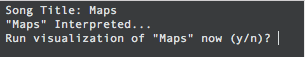
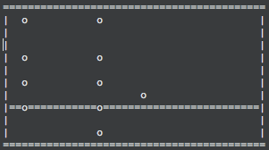

# Drum Tab Visualizer

This was a small project I started to make a Rock Band / Guitar Hero type visualization of drum tabs. 

The project is built with a Python script to convert the drum tab (from a `.txt`) to a `.dat` file that is then piped into an animator binary ([a project from my introductory CS class](http://www.cs.tufts.edu/comp/11/assignments/proj2/index.html)). It is essentially the same exact code (fish naming and all) except I added the border / background for the tab visualization.

To run, simply run the python script (`python drum-tab.py`), name a song that has an included text file (like the included `maps-tab.txt`) and run it.